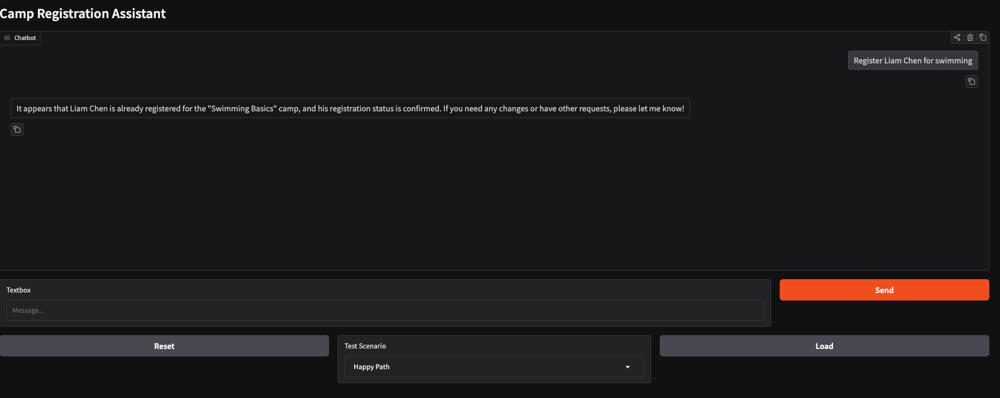

# Camp Registration Assistant — Design Notes

## Getting started

1. Copy `.env.example` to `.env` and add your `OPENAI_API_KEY` (or just create a `.env` with `OPENAI_API_KEY=sk-...`)
2. Install dependencies with [uv](https://github.com/astral-sh/uv):

```bash
uv sync
```

3. Run the assistant:

```bash
uv run python agent.py
```

This opens a Gradio chat interface at `http://localhost:7860`. A dropdown in the UI lets you load pre-built test scenarios (happy path, age restriction, schedule conflict, etc.) without typing them out manually.

To run the evaluation suite instead:

```bash
uv run python eval_app.py
```

---



A few notes on the choices I made and why.

---

## Why the OpenAI Agents SDK

Day-to-day I work with **Google's ADK**, and I've used **LangGraph** before for multi-agent orchestration. I didn't use either here.

This task is a single conversational agent with tools and guardrails. The OpenAI Agents SDK handles that with almost no boilerplate. LangGraph would have needed an explicit state graph — nodes, edges, state schemas — which is great when you have branching workflows, but overkill here. I picked the tool that fit the problem rather than the one that looked most impressive.

---

## Tool design (`tool_schemas.py`)

Six tools, one per operation.

**Read tools** (`get_camps`, `get_kids`, `get_registrations`) all accept optional filters so the model can narrow results in a single call. `get_registrations` also returns `kid_name` and `camp_name` alongside the raw IDs — without that, the model gets back `kid-1` and `camp-3` and either makes extra lookups or starts hallucinating names.

**Write tools** do all validation in Python, not in the LLM:

- age range check against `min_age` / `max_age`
- camp status (no registrations to cancelled camps)
- duplicate detection (same child, same camp, non-cancelled status)
- schedule conflicts — date overlap *and* time slot overlap both have to hold; morning and afternoon camps on the same week are fine
- capacity / waitlist — full camp means automatic waitlist, not a hard rejection
- enrollment counter — cancellations decrement `enrolled` and auto-promote the earliest waitlisted child

Keeping this in Python makes it deterministic and testable. The LLM doesn't need to reason about it and can't get it wrong.

One annoying detail: optional parameters need `str | None = None`, not `str = None`. The SDK generates JSON schemas directly from signatures, and the second form produces a non-nullable field, which confuses the model about whether the parameter is required.

---

## Guardrails (`agent.py`)

**Input guardrail** — a `gpt-4o-mini` classifier runs before the main agent on every message. It catches offensive content and prompt injection, then triggers a tripwire that returns a polite refusal. I kept it permissive on purpose — complaints, cancellations, mentions of a child's age should all pass through fine.

`run_in_parallel=False` because the guardrail has to finish before the main agent starts, not race it.

**Tool input guardrail** — attached to all three write tools. Checks that `kid_id`, `camp_id`, and `registration_id` actually look like IDs (`kid-`, `camp-`, `reg-` prefixes). The most common model mistake is passing `"Emma"` instead of `"kid-1"` — this catches it early and tells the model to do the lookup first.

**Custom failure error function** — write tools return errors formatted as:

```
VALIDATION_ERROR: <message>. Do NOT call any more tools. Report this error directly to the user and stop.
```

Without the explicit stop instruction, the model sometimes enters a recovery loop trying alternative tools and burns through `max_turns`. The instruction kills that.

---

## Conversation state

`CampAssistant` keeps `self._history`. Each turn appends the user message, runs the agent, then replaces the history with `result.to_input_list()` — which includes tool calls and their results, not just the text. The model has full context on every turn.

Each `Runner.run()` call is wrapped in a `trace()` session, which pushes everything to the OpenAI tracing dashboard. Useful for debugging when the agent does something unexpected and you can't tell why from the output alone.

---

## Confirmation before writes

The system prompt tells the agent to confirm with the user before calling any write tool. So it gathers the info, presents a summary ("Register Liam Chen for Soccer Stars, July 14–18, $200?"), and only calls `register_kid` after the user says yes.

I considered the SDK's `RunState` interrupt mechanism, but skipped it. It requires serialising state between turns, which adds real complexity to the Gradio interface. The prompt-level approach is simpler, the confirmation message is more informative, and it naturally demonstrates multi-turn handling anyway.

---

## System prompt

Two things it encodes:

**No pre-existing knowledge** — the model is told it has no information about camps, children, or registrations and must call a tool before answering anything. Without this, `gpt-4o-mini` will invent plausible-sounding camp names from training data.

**Behavioural rules** — confirm before writes, resolve ambiguous names by listing all matches before proceeding, offer the waitlist when a camp is full, and stop after validation errors rather than trying to recover.

---

## Evaluation (`eval.py`, `eval_app.py`, `evals.json`)


30 test cases: camp discovery, availability, data integrity (age rules, cancelled camps, duplicates, conflicts), ambiguous names, conversational behaviour, and guardrails.

Two evaluation methods:

**Keyword matching** — fast and deterministic. Works well when the correct response has a clear lexical signal (e.g. "age" must appear when an age restriction fires).

**LLM judge** — a second `gpt-4o-mini` reads the test description and response and returns `{passed, reason}`. Better for cases where the correct answer is harder to express as a keyword. Costs one extra API call per case.

When both run together, disagreements are flagged with ⚠️ — those are the interesting ones to look at manually.

`eval_app.py` is a Gradio dashboard with two tabs: run evaluations live (results update row by row), or load the last saved results from `eval_results.json`. Results are saved after each run.

```bash
uv run python eval_app.py
```
