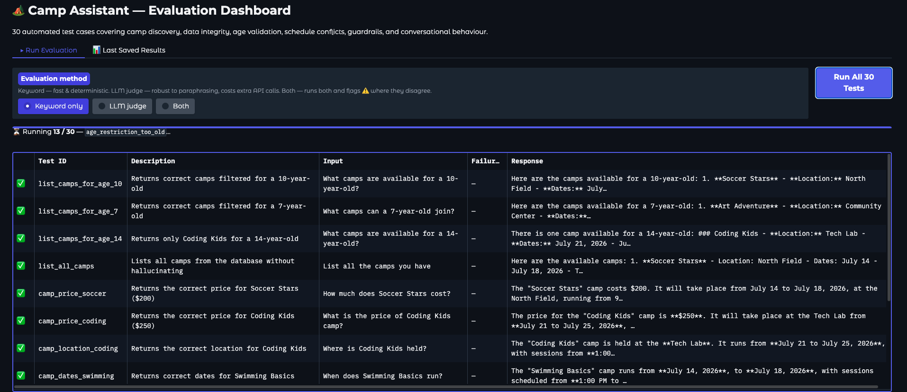

# Implementation Notes

This document explains the key design decisions behind the Summer Camp Registration Assistant, why certain tools and patterns were chosen over alternatives, and how each piece fits together.

---

## Why OpenAI Agents SDK

In my day-to-day work, I currently build agentic workflows primarily using **Google's Agent Development Kit (ADK)**. I have also worked with **LangGraph** in the past for orchestrating agent workflows.

For this assignment, I intentionally chose the **OpenAI Agents SDK** because it was the most straightforward tool for the problem. The task requires a single conversational agent with tool usage and guardrails, and the SDK provides these capabilities with minimal setup and very little framework overhead.

Using LangGraph would have required defining an explicit state graph (nodes, edges, and state schemas). While this approach is very powerful for complex multi-agent systems and workflow-style orchestration, it introduces additional complexity that was unnecessary for this relatively simple conversational agent.

The goal for this implementation was therefore **not to showcase a complex framework**, but to select the tool that best fits the problem while keeping the implementation clear, maintainable, and easy to reason about.

---

## Tool Design (`tool_schemas.py`)

The six tools map directly to the six operations in the README. Each is a plain Python function — the SDK wraps them with `function_tool()`, which generates the JSON schema the model uses to call them.

### Read tools

`get_camps`, `get_kids`, and `get_registrations` accept optional filter parameters so the model can narrow results in a single call rather than fetching everything and reasoning over it.

`get_registrations` is enriched to include `kid_name` and `camp_name` alongside the raw IDs. Without this, the model receives opaque IDs (`kid-1`, `camp-3`) and is forced to make additional lookup calls or, worse, hallucinate names.

### Write tools — data integrity

The write tools (`register_kid`, `cancel_registration`, `update_registration_status`) perform all validation in Python, not in the LLM:

- **Age range** — a child cannot be registered for a camp outside their `min_age`/`max_age` range
- **Camp status** — cancelled camps reject new registrations immediately
- **Duplicate check** — re-registering a child already enrolled (with a non-cancelled status) is rejected
- **Schedule conflict** — both date range overlap AND time slot overlap must hold before a conflict is raised; a child in a morning camp and an afternoon camp on the same week is fine
- **Capacity / waitlist** — if `enrolled >= capacity`, the child is automatically waitlisted rather than rejected outright
- **Enrollment consistency** — `cancel_registration` and `update_registration_status` both decrement the `enrolled` counter and automatically promote the earliest waitlisted child when a spot opens

Keeping this logic in Python (rather than relying on the LLM to reason about it) makes it deterministic, testable, and immune to model hallucination.

### Type hints matter

Optional parameters use `str | None = None` (not `str = None`). The SDK generates JSON schemas directly from function signatures; the incorrect form produces a non-nullable string schema, which confuses the model about whether the parameter is required.

---

## Guardrails (`agent.py`)

Two independent guardrail layers protect the agent:

### 1. Input guardrail — inappropriate content

An `@input_guardrail` runs a dedicated `gpt-4o-mini` classifier *before* the main agent sees the message. It checks for offensive, abusive, or prompt-injection attempts and triggers a tripwire that silently blocks the message and returns a polite refusal. The guardrail is intentionally permissive for normal registration language — complaints, cancellations, mentions of a child's age — so it does not generate false positives on legitimate requests.

`run_in_parallel=False` is set deliberately: the guardrail must complete before the main agent runs, not concurrently with it.

### 2. Tool input guardrail — ID format validation

A `@tool_input_guardrail` attached to all three write tools intercepts calls before execution. It checks that `kid_id`, `camp_id`, and `registration_id` follow the expected prefixes (`kid-`, `camp-`, `reg-`). This catches the most common model mistake — passing a human name (`"Emma"`) instead of the resolved ID (`"kid-1"`) — and returns an explicit rejection message instructing the model to call the lookup tool first.

### Custom failure error function

Write tools are registered with a `failure_error_function` that formats validation errors as:

```
VALIDATION_ERROR: <message>. Do NOT call any more tools. Report this error directly to the user and stop.
```

Without this, the default SDK error message is generic and the model sometimes enters a recovery loop (trying alternative tools) that can exhaust the `max_turns` budget. The explicit instruction to stop prevents that.

---

## Multi-turn conversation

`CampAssistant` is a stateful class. Each `chat()` call appends the user message to `self._history`, runs the agent, then replaces `self._history` with `result.to_input_list()`. This preserves the full conversation — including all tool calls and their results — so the model has complete context on every turn.

A session-level `trace()` wraps each `Runner.run()` call. This sends the full turn (input, tool calls, tool results, output) to the OpenAI tracing dashboard, which is invaluable for debugging non-obvious agent behaviour.

---

## Confirmation before writes

The system prompt instructs the agent to always confirm with the user before calling any write tool. This is a **conversational guarantee** implemented at the prompt level: the model gathers the necessary information (child name, camp name, details), presents a confirmation summary, and only calls `register_kid` / `cancel_registration` after the user says yes.

This approach was chosen over a technical interrupt mechanism (like the SDK's `RunState` approval flow) because:
- The confirmation is contextual and informative ("Register Liam Chen for Soccer Stars, July 14–18, $200?") rather than a generic yes/no gate
- It naturally demonstrates multi-turn conversation handling, which is an explicit requirement
- The SDK interrupt approach requires serialising `RunState` between turns, adding significant state-management complexity to the Gradio interface

---

## System prompt design

The system prompt encodes two types of constraints:

**Hard data access rules** — the model is told it has *no* pre-existing knowledge of camps, children, or registrations and must call a tool before answering anything. This prevents hallucination: without this instruction, `gpt-4o-mini` will confidently invent camp names from its training data.

**Behavioural guidelines** — confirmation before writes, ambiguous name resolution (list all matches before proceeding), waitlist offers when a camp is full, and a "then stop" instruction after validation errors to prevent recovery loops.

---

## Evaluation (`eval.py`, `eval_app.py`, `evals.json`)




### Test set

30 test cases covering:
- Camp discovery (filtering by age, listing all, prices, dates, locations)
- Availability (open spots, full camps)
- Data integrity (age restrictions, cancelled camps, duplicate registration, schedule conflicts)
- Ambiguous input (multiple children with the same first name)
- Conversational behaviour (confirmation before writes, incomplete requests, unknown camps)
- Guardrails (inappropriate / prompt-injection attempts)

### Evaluation methods

Two methods are available and can be run independently or together:

**Keyword matching** — checks that the agent's response contains (or does not contain) specified strings. Fast, deterministic, and easy to reason about. Sufficient for most cases where the correct response has a clear lexical signal (e.g. the word "age" must appear when an age restriction fires).

**LLM judge** — a second `gpt-4o-mini` agent reads the test description, user input, and agent response and returns a structured `{passed, reason}` verdict. More robust to paraphrasing and useful for cases where the correct response is harder to pin down with keywords. Costs one extra API call per case.

When both methods are run together, disagreements are flagged with ⚠️ — these are the most interesting cases to inspect manually.

### Eval app

`eval_app.py` is a standalone Gradio dashboard with two tabs:
- **Run Evaluation** — executes all 30 tests live, updating the results table row by row with the selected evaluation method
- **Last Saved Results** — loads the most recent run from `eval_results.json`; auto-loads on startup

Results are saved to `eval_results.json` after each run, providing a persistent artefact that can be committed alongside the submission.

```bash
uv run python eval_app.py
```
