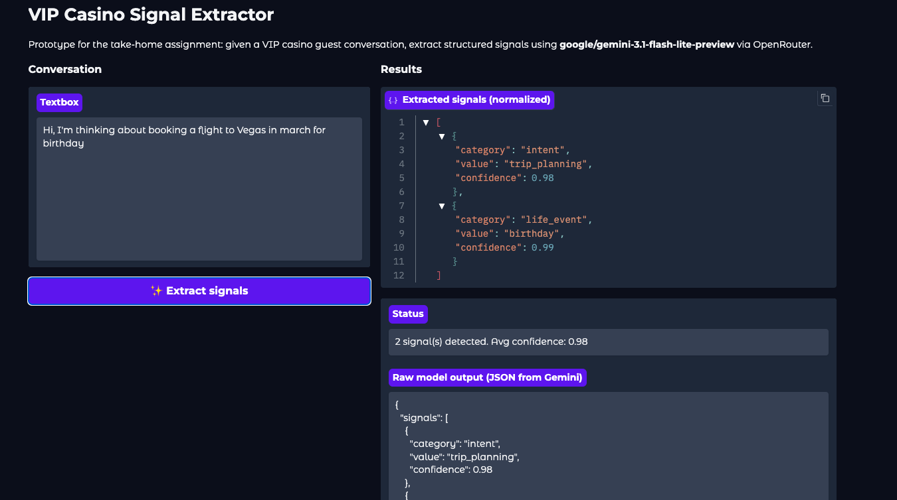

# Signal Extraction Benchmark

Structured signal extraction from VIP casino guest conversations, evaluated across multiple frontier LLMs.

---

## Dataset

Since no labeled dataset was provided for the task, a synthetic dataset was created to simulate realistic VIP casino guest conversations.

The goal of the dataset is to reproduce the types of conversational signals that a casino host or concierge system might encounter when interacting with high-value guests.

These signals span five categories:

| Category | Values |
|---|---|
| `intent` | `trip_planning`, `room_booking`, `dining_booking` |
| `value` | `suite_preference`, `high_budget`, `large_group`, `vip_expectation` |
| `sentiment` | `positive_experience`, `negative_experience` |
| `life_event` | `birthday`, `anniversary`, `honeymoon`, `promotion`, `celebration` |
| `competitive` | `competitor_wynn`, `competitor_cosmo`, `competitor_bellagio`, `competitor_offer` |

This is a **multi-label structured information extraction problem**: a single conversation can contain several signals across multiple categories. The dataset was generated using a frontier model and reviewed for consistency.

> All data is fully synthetic. No real guest or personally identifiable information was used.

---

## Infrastructure

Model benchmarking was performed through **OpenRouter**, which provides a unified API for accessing multiple LLM providers.

This allowed evaluating several frontier and open-source models using the same inference pipeline, ensuring consistent prompts, evaluation logic, and metrics across all models.

---

## Model Selection

The goal of the model selection process was to identify models that offer **the best trade-off between cost and performance**, while also considering latency.

Based on benchmark performance and pricing constraints, the following models were evaluated:

| Model | Provider |
|---|---|
| `google/gemini-3.1-flash-lite-preview` | Google |
| `xiaomi/mimo-v2-flash` | Xiaomi |
| `deepseek/deepseek-v3.2` | DeepSeek |
| `x-ai/grok-4.1-fast` | xAI |
| `openai/gpt-5-nano` | OpenAI |


### Evaluation Metrics

Each model was evaluated using standard information retrieval metrics computed at the signal level (micro-averaged):

- **Precision** — fraction of predicted signals that are correct
- **Recall** — fraction of ground-truth signals that were found
- **F1 Score** — harmonic mean of precision and recall

---

## Results


**`google/gemini-3.1-flash-lite-preview` was selected for the production prototype** given its top precision (1.00), strong F1, and best cost-to-performance ratio among the evaluated models.

A natural next step would be to integrate this model into an **agentic workflow**, allowing it to extract signals in real time from guest conversations and trigger downstream actions (e.g., alert the host, personalize the offer).

---

## Prototype App

A Gradio app (`app.py`) was built to demo the signal extraction pipeline interactively.



**Features:**
- Paste any guest conversation (one turn per line)
- Click **"✨ Extract signals"** to call `google/gemini-3.1-flash-lite-preview` via OpenRouter
- Returns normalized signals with a **per-signal confidence score** provided by the LLM
- Shows average confidence across detected signals
- Displays the raw model JSON response for transparency

### How to run

1. Install dependencies:

```bash
pip install openai gradio python-dotenv
```

2. Create a `.env` file at the repo root with your OpenRouter API key:

```
OPENROUTER_API_KEY=sk-or-...
```

3. Launch the app:

```bash
cd conv_classifiation
python app.py
```

4. Open `http://127.0.0.1:7860` in your browser.

### Example output

Input conversation:
```
We're planning a birthday trip for my wife.
Our host usually books us a suite when we visit.
```

Extracted signals:
```json
[
  { "category": "intent",     "value": "trip_planning",   "confidence": 0.97 },
  { "category": "life_event", "value": "birthday",        "confidence": 0.95 },
  { "category": "value",      "value": "suite_preference","confidence": 0.93 },
  { "category": "value",      "value": "vip_expectation", "confidence": 0.88 }
]
```
